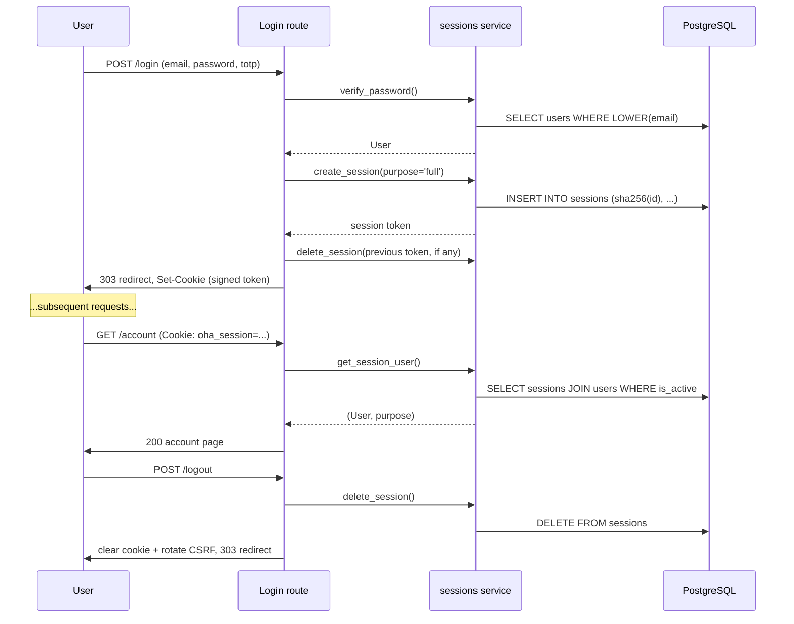
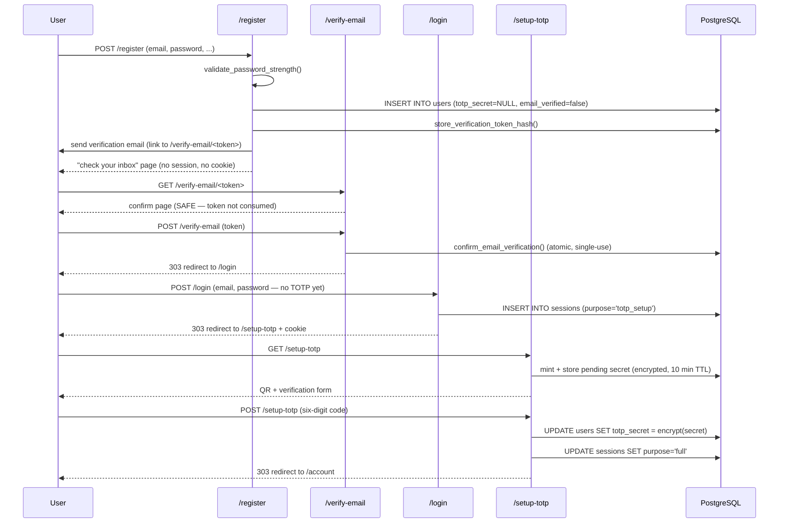
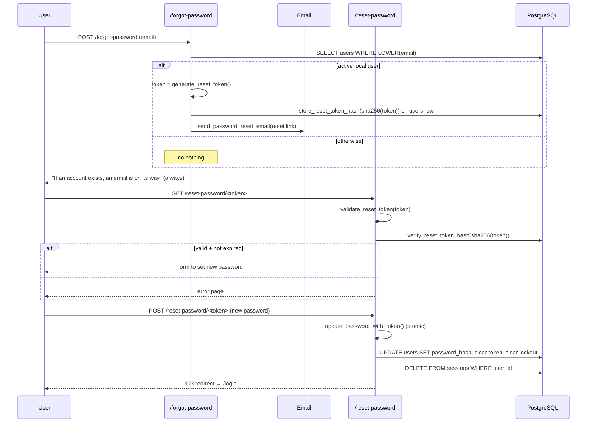

# Authentication & Sessions

This page describes the full authentication subsystem: how passwords are stored, how sessions work, how TOTP enrolment and email verification are enforced, how the password reset flow protects against enumeration, and how CSRF is wired up. It is the longest of the architecture pages because authentication is where most of the security-sensitive code lives.

## Design choices in one sentence each

- **Server-side sessions, not JWT.** The cookie holds only a signed random ID; the actual session lives in PostgreSQL, which means logout and admin revocation are real, immediate events.
- **Email verification is required for local users.** A new local account cannot complete login or TOTP setup until the email is verified, and unverified accounts are reaped after a configurable number of days.
- **TOTP is mandatory for local users.** A verified local account cannot reach the application until the second factor is enrolled.
- **TOTP secrets are encrypted at rest.** A database compromise alone does not let an attacker generate valid codes.
- **TOTP codes cannot be replayed.** A verified code's time-step is consumed atomically, so a captured code is single-use.
- **Passwords use argon2id.** With the strong defaults from `argon2-cffi`, and rehash-on-login when parameters change.
- **Account lockout.** After a configurable number of failed logins, the account is locked for a configurable window (and the owner is notified by email).
- **Common-password blocklist.** SecLists 10k, plus contextual checks against the user's email and display name, plus a 12-character minimum.
- **CSRF is a route-level dependency.** You can see which POST routes are protected by reading their signatures.
- **Reset, verification, and email-change tokens are hashed in the database.** A database dump does not expose live links.
- **No account enumeration.** Login, registration, verification resend, and password reset all return identical responses for the "exists" and "does not exist" cases where it matters.

## Sessions

### What's in the cookie

The session cookie is named `oha_session` (configurable). Its value is the session ID — a 32-byte URL-safe random token — wrapped in `itsdangerous.URLSafeTimedSerializer`, which signs and timestamps it with `SESSION_SECRET`. The serializer rejects tampered cookies and cookies older than `SESSION_MAX_AGE_SECONDS` (default 8 hours).

The cookie is set with `HttpOnly`, `Secure` (in production), `SameSite=Strict`, and a `Path=/` scope. `SameSite=Strict` means the browser never attaches the cookie to a request that originated from another site — including top-level navigations — which is a strong anti-CSRF baseline. The HMAC-bound CSRF token (below) is the second, independent layer.

### What's in the database

`sessions` is a thin table:

```text
id            text       primary key (sha256 of the session token)
user_id       int        references users(id) on delete cascade
purpose       text       'full' | 'totp_setup'
flash_message text       nullable
flash_category text      nullable ('success' | 'error' | 'info')
ip_address    text
created_at    timestamptz
expires_at    timestamptz
```

The stored `id` is the SHA-256 of the random token; the cookie carries the signed plaintext token. The `purpose` column is the cornerstone of the TOTP enforcement story (see below). The `flash_message` / `flash_category` columns carry one-shot status messages across redirects (e.g. "Display name updated") so the application does not depend on query strings or in-memory storage; `consume_flash` reads and clears them atomically.

### Lifecycle



A new random session ID is issued on every login, and any prior session presented with the login request is revoked — so there is no session-fixation window. The scheduler process runs `cleanup_expired_sessions` every hour, deleting rows where `expires_at < now()`.

## Local-account login

`POST /login` does the following (after the `verify_csrf` and `validate_form_content_type` dependencies run):

1. Look up the user and verify the password in one call to `verify_password()`, which uses argon2 verification and rehashes if the stored parameters are out of date. A non-existent user, wrong auth method, inactive account, or currently locked account all run a dummy verify so the timing is not informative.
2. If the account is locked (`locked_until` in the future), reject with the **same generic 401 message** used for every other failure — the lock expiry is written to the audit log (`login_blocked_locked`), never shown to the client.
3. On a wrong password (for a local account), increment the failure counter via `record_login_failure`, which locks the account once the threshold is reached; audit `login_failed` (and `account_locked` if this attempt crossed the threshold, which also emails the owner a lockout notice).
4. If the user has TOTP configured, verify the submitted six-digit code with `verify_and_consume_totp` — a one-step window for clock skew, and the matched time-step is atomically consumed so the same code cannot be replayed. A wrong code is treated like a wrong password for lockout/audit purposes.
5. Clear the failure counter on success. If the local user's email is not verified, refuse login with a message pointing to the send_verification page (audit `login_blocked_unverified`).
6. Create a session — `purpose='full'` if TOTP is configured, otherwise `purpose='totp_setup'` — revoke any prior session, set the cookie, and redirect: to `/setup-totp` if TOTP is not yet configured, otherwise to the validated `next` URL (`safe_redirect_url` blocks open redirects).
7. On any failure the login page is re-rendered with a **generic** 401 error ("Invalid email, password, or authentication code"), identical for wrong password, wrong TOTP, unknown user, locked account, and inactive account.

## Registration and email verification

Registration is a multi-step flow that prevents the application from being usable without a verified email and an enrolled second factor. Importantly, **registration itself creates no session** — the account only becomes usable through the normal login path.



Properties of this flow:

- The account is created immediately with `totp_secret = NULL` and `email_verified = false`, but **no session is created and no cookie is set** — the response is the generic "check your inbox" page. A duplicate registration renders the *identical* page (the existing address receives an email notice instead), so the form cannot be used to enumerate accounts.
- The verification **GET is side-effect-free**: it only validates the token and shows a confirm button, so mail-gateway scanners and link prefetchers cannot burn the single-use token. The **POST consumes it**. That POST deliberately skips `verify_csrf` — the link may be clicked on a device with no app session or CSRF cookie, and the signed, single-use, email-bound token *is* the capability.
- Verification tokens are itsdangerous-signed (24-hour expiry), stored only as a SHA-256 hash on the user row, and confirmed atomically: `confirm_email_verification` sets `email_verified=true` and clears the hash in a single `UPDATE` that also checks the token age and that the current email still matches the token's email, so a second click fails and a stale token cannot verify a changed address.
- `/send_verification` issues a fresh link for an unverified account but always shows the same generic success message, so it cannot be used to enumerate accounts either.
- Logging in with password only (TOTP not yet enrolled) yields a `purpose='totp_setup'` session. The gate middleware restricts that purpose to the exempt prefixes `/setup-totp`, `/logout`, and `/verify-email` — anything else redirects back to `/setup-totp`.
- `/setup-totp` shows a "verify your email" page until `email_verified` is true; only then does it present the QR code. The GET deliberately *writes* (mints and stores an encrypted pending secret with a 10-minute TTL) — a documented exception to GET-safety, accepted because the secret must exist server-side before the QR encoding it can be rendered, the write is authenticated, and it overwrites rather than accumulates.
- The pending TOTP secret is stored server-side keyed by user ID (never trusted from a hidden form field), so the POST handler retrieves it by user ID. On success, `update_totp_secret` writes the Fernet ciphertext (and records the just-used code's time-step so it cannot be replayed as a login), and `upgrade_session_purpose` bumps the session to `full`.
- Unverified local accounts older than `UNVERIFIED_REAP_AFTER_DAYS` are deleted by the scheduler's `reap_unverified` job.

## TOTP enforcement: belt and braces

Two independent checks protect the application from local users who have not configured TOTP. Both live in `TotpGateMiddleware` — a dedicated middleware registered *inside* the security-headers and audit layers, so its redirects carry the standard security headers and appear in the audit log. It reads the state that the (outer) session-resolution middleware has already populated:

1. **Purpose gate.** A `purpose='totp_setup'` session can only reach the exempt prefixes. This is the primary control.
2. **Mandatory enrolment gate.** Even on a `purpose='full'` session, a local user with `totp_secret=NULL` is redirected to `/setup-totp` until enrolment completes. This is a defense-in-depth backup — if some future code path created a `full` session before TOTP was set up, this gate would still catch it.

The two gates are different code paths and would have to be broken simultaneously to bypass TOTP. That redundancy is intentional and called out in the source comments.

## Changing the authenticator

Logged-in local users can rotate their authenticator at `/account/reset-totp`. This is **self-service** and requires proving control of the current authenticator: the form takes the current six-digit code *and* a code from the new secret, and the new secret is only promoted if both verify (the current code is also replay-consumed). There is no admin-driven TOTP reset route; a user who has lost their authenticator outright (and so cannot supply a current code) must contact an administrator.

## Password reset

The reset flow is designed so that **the email address is not enumerable** and **a database dump does not expose live reset links**.



Key properties:

- **Tokens live as hashed columns on `users`**, not in a separate table. `store_reset_token_hash` writes `password_reset_token_hash` + `password_reset_created_at`; issuing a new token overwrites the old one, so only one reset link is ever valid.
- **The plaintext token only exists in the email.** What is stored is `sha256(token)`. A read-only DB compromise yields hashes, which cannot be used to reset anyone.
- **The success message is identical** for "we sent you a mail" and "no such user / inactive / federated account", preventing enumeration.
- **`update_password_with_token` is atomic and defense-in-depth:** it re-validates password strength, rejects reuse of the current password, and performs the update in a single `UPDATE ... WHERE` that checks the token hash and a DB-level age window. On success it clears the token, resets the failed-login counter and lockout, and deletes all of the user's sessions.

## Password storage and validation

Passwords are hashed with argon2id via `argon2-cffi`'s `PasswordHasher()` defaults. `verify_password` rehashes on a successful login if `check_needs_rehash` reports stale parameters, so the cost factors can be raised over time without a migration.

Strength validation lives entirely in `password_validation.validate_password_strength()`:

1. A **12-character minimum** (`_MIN_PASSWORD_LENGTH`). The form layer only bounds the maximum length — the minimum is enforced here. Twelve characters alone eliminate almost the entire SecLists 10k list by length.
2. The lower-cased password is checked against the SecLists 10k blocklist (lazy-loaded once into a `frozenset`).
3. Passwords containing the user's email local part or a word from the display name (length ≥ 4) are rejected.

The same rules apply to registration, password reset, and the admin-seed password.

## CSRF

CSRF protection follows the **double-submit cookie** pattern, hardened by binding the token to the session:

1. The CSRF cookie middleware sets a `csrf_token` cookie on GET responses. The token is not random — it is `HMAC(SESSION_SECRET, identifier)`, where `identifier` is the session ID for logged-in users or a per-visitor pre-session ID for anonymous visitors. The cookie is `HttpOnly` and `SameSite=Strict`; templates obtain the value server-side via `{{ csrf_token(request) }}`, so JavaScript never needs to read it.
2. Templates with forms emit the token as a hidden input.
3. POST handlers depend on `verify_csrf`, which requires: the cookie and form field are both present, the form value is a string, the two match (`hmac.compare_digest`), a current identifier exists, and the cookie equals the HMAC recomputed from that identifier. Any failure returns 403.

Because the token is HMAC-bound to the identifier, a stolen cookie is useless without the matching session, and the token rotates automatically when the identifier changes (pre-session → session). Explicit rotation also happens on logout. Because verification is a route dependency rather than global middleware, you can grep for `verify_csrf` to enumerate every protected endpoint. (Two deliberate exceptions skip it: the verification and email-change **confirm POSTs**, where the signed single-use token itself is the capability and the click may come from a device with no app cookies — see the source comments on those routes.)

## Admin actions

`routes/auth/admin.py` mounts everything under `/admin` with `Depends(require_admin)` at the *router* level, so every handler beneath inherits the check. `require_admin` checks `request.state.user.is_admin` and raises `HTTPException(404)` (not 403) for everyone else, so the existence of the admin area is not revealed.

Admin actions include:

- Listing all users
- Changing a user's `access_tier`
- Toggling `is_active` (deactivation also deletes the user's sessions immediately; reactivation clears lockout but does not restore sessions)
- Toggling `is_admin` (admins cannot demote or deactivate themselves)
- Staging an email change for a user (a confirmation link is sent to the new address and a notice to the old one; the change commits only when the link is clicked)

All POST actions are CSRF-protected and content-type-checked, set a flash message on the admin's own session, and are recorded to the audit channel (`audit_admin_action`) with the acting admin, the target user, and old/new values.

## Federated (Shibboleth) login

The `GET /auth/shibboleth/callback` route is implemented. When `SHIBBOLETH_ENABLED=true`, the nginx SP layer (shibd) forwards attribute headers (`REMOTE_USER`, `mail`, `displayName`, `affiliation`, and the configured country header) on this path — and strips them on every other path.

The route's trust model is **not** an IP allowlist:

1. Gunicorn binds only a Unix socket, so there is no TCP listener to reach; the route additionally *refuses* any request that arrives with a TCP peer (that would mean the app was accidentally exposed on a port).
2. nginx injects an `X-Internal-Auth` header on this location only, and the route requires it to match `SHIBBOLETH_INTERNAL_SECRET` in constant time. The settings validator makes this secret mandatory **whenever Shibboleth is enabled, in every environment** — there is no "optional in dev" mode.

On a trusted request, the route validates the forwarded email and auto-provisions or updates the user (`create_shibboleth_user`): `auth_method='shibboleth'`, `access_tier='registered'`, auto-`email_verified`, attributes refreshed on each login. If the email already belongs to a **local** account, the upsert deliberately refuses to merge and the login is rejected with an account-conflict error — a federated login can never take over a password account. A `full` session is then created (Shibboleth users are exempt from the local TOTP requirement; their second factor is the IdP's concern).

The remaining Phase 2 work is the nginx SP deployment (shibd + FastCGI via the nginx-http-shibboleth module) and SWITCH AAI registration, not application code.

## What is *not* implemented yet

- **Password rotation reminders.** No "your password is 365 days old" prompt.
- **Self-service recovery without an authenticator.** Rotating TOTP at `/account/reset-totp` requires the current code, so a user who has lost their authenticator entirely must contact an administrator. There is no admin UI button to clear a TOTP secret — recovery currently means an out-of-band/database intervention.
- **Field-level visibility.** Redaction is all-or-nothing per dataset (see [Access Control & Visibility](access-control.md)); the per-field matrix and PostgreSQL Row-Level Security are Phase 2.
- **Shibboleth SP deployment.** The callback and user model are in place; the nginx SP plumbing (shibd + FastCGI) and federation registration are Phase 2.
