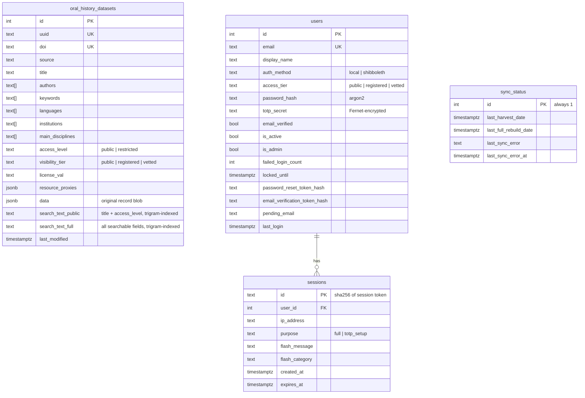

# Data Model

The application has a small, deliberate data model. Four tables in PostgreSQL, two principal Python dataclasses, and a strict invariant between them. This page explains what each table holds, how the dataclasses relate to the SQL columns, and the orthogonal authorization fields on `Dataset` that often confuse first-time readers.

## Tables

A few things worth noting that the diagram cannot show in full:

- `oral_history_datasets.uuid` is the unique key from the upstream OAI-PMH source. It is what `ON CONFLICT` upserts target. `doi` is also unique.
- There are **two** trigger-maintained search columns, not one. `trg_search_text` fires on every INSERT/UPDATE and fills `search_text_public` (title + access level — exactly the fields that survive redaction) and `search_text_full` (title, description, project title, project description, keywords, authors). Each has a `pg_trgm` GIN index so ILIKE substring search is index-backed. The split is what lets free-text search stay tier-safe: every dataset is matchable on the public blob, but the full blob is only matched against rows the searching user may fully see (see [Access Control & Visibility](access-control.md)).
- The reset / verification / email-change flows store **hashed, single-use tokens directly on the `users` row** (`password_reset_token_hash`, `email_verification_token_hash`, `pending_email_token_hash`) plus their `*_created_at` timestamps. There is no separate token table. The plaintext token only exists in the email; a database dump yields hashes, which cannot be replayed.
- `users` also carries the lockout counters (`failed_login_count`, `locked_until`) and the pending-TOTP columns used during enrolment.
- `sessions.id` is the SHA-256 hash of the random session token; the cookie holds an itsdangerous-signed copy of the *plaintext* token, never the hash.

## Dataclasses

The `services/` layer wraps SQL rows in dataclasses before passing them up to the routes. Two are central.

### `Dataset`

Defined in `services/datasets.py`. Every field on this class corresponds to a column read in `DATASET_SELECT_COLUMNS` (defined in `services/schema.py`), with two exceptions: `download_url` and `landing_page_url` are computed in `_parse_dataset()` from the `resource_proxies` JSONB blob. Note that `institutions` and `main_disciplines` are harvested and stored in the table but are **not** on the `Dataset` dataclass and are not selected in normal reads, so they never reach a template.

The two authorization fields are intentionally orthogonal:

| Field | Set by | Means |
|---|---|---|
| `access_level` | Sync layer, derived from the upstream license string | Whether you are allowed to **download** the actual recordings/transcripts. `public` or `restricted`. |
| `visibility_tier` | Ingest policy ceiling, then administrators (directly in the database) | Which **metadata** fields you can see. `public`, `registered`, or `vetted`. |

So a dataset can be `access_level='public'` (anyone can download the materials) but `visibility_tier='vetted'` (only vetted users can see the description). It can also be the other way around: `access_level='restricted'` (you have to go through the source repository's request process to download) but `visibility_tier='public'` (anyone can read the description and decide whether to make a request). Treating the two as one field would conflate "can you read about it" with "can you have it", and these are different policy questions.

`filter_for_tier(dataset, user_tier)` enforces the visibility side. It compares the user's tier rank against the dataset's `visibility_tier`. If the user's rank is below the requirement, it returns a new `Dataset` with the sensitive fields nulled out — only `id`, `uuid`, `title`, `access_level`, `version`, `source`, and `visibility_tier` survive. Everything else (authorship, descriptions, languages, keywords, citations, license, DOI, resource type, and the download/landing URLs) is removed. The service-layer query functions apply this filter themselves before returning, so routes never hold an unredacted row for a below-tier user.

### `User`

Defined in `services/users.py`. Every field corresponds to a column on `users` except `totp_configured`, which is a computed boolean — `True` if the row has a `totp_secret` (derived in SQL via `(totp_secret IS NOT NULL) AS totp_configured`). The raw secret is **never** exposed on the dataclass.

`auth_method` distinguishes local accounts (`"local"`, password + TOTP, email verification required) from federated accounts (`"shibboleth"`, attributes from the reverse proxy, auto-verified). `access_tier` controls what metadata they can see. `is_admin` controls whether they can reach `/admin/*`. `email_verified` gates whether a local user may complete login and TOTP setup.

### Smaller dataclasses

`Author` is a thin wrapper around `{name: str}` so the template can iterate `dataset.authors` and call `.name` consistently, regardless of whether the upstream source delivered authors as plain strings or as objects.

## The schema invariant

The single most error-prone part of the system is keeping the SQL `SELECT` column list in sync with the dataclasses. Add a field to one and forget the other and you get an error deep in `_parse_*` weeks later, or a silent `None`.

`services/schema.py` is the **single source of truth** for the dataset column lists:

- `DATASET_COLUMNS` — columns inserted during sync (includes `institutions`, `main_disciplines`)
- `DATASET_SELECT_COLUMNS` — columns selected during reads (excludes the two array columns not on the dataclass)
- `DATASET_INSERT_COLUMNS` — `DATASET_COLUMNS` plus `data` and `last_modified`
- `DATASET_COMPUTED_FIELDS` — fields on `Dataset` that are *not* read from columns (`download_url`, `landing_page_url`)

Five checks run at startup:

- `validate_dataset_schema()` asserts `set(Dataset.fields) - DATASET_COMPUTED_FIELDS == set(DATASET_SELECT_COLUMNS)`.
- `validate_dataset_insert_schema()` asserts `DATASET_INSERT_COLUMNS` ends with `data`, `last_modified` after `DATASET_COLUMNS`.
- `validate_user_schema()` (in `users.py`) does the equivalent check for `USER_COLUMNS` and the `User` dataclass, minus the computed `totp_configured`.
- `assert_redaction_total()` (in `datasets.py`) asserts every `Dataset` field is classified as either tier-visible or redacted, exactly once — a field in neither set would silently leak or vanish after redaction.
- `validate_schema_against_db()` (in `db_drift.py`) checks the **live database** has every column the code references on `oral_history_datasets`, `users`, and `sessions` — including columns touched only by raw SQL (auth/TOTP/token columns, flash/purpose columns), which no dataclass would catch.

If anything has drifted, the app refuses to start with an error naming the missing fields on each side. The same assertions run as unit tests (`test_schema.py`), so the regression is caught in CI long before production. <!-- TODO(tests-rework): update this section once the new test suite lands -->

When you add a column to `oral_history_datasets`:

1. Write the Alembic migration.
2. Add the column name to `DATASET_COLUMNS` (and `DATASET_SELECT_COLUMNS` if it should be read back).
3. Add the field to the `Dataset` dataclass with a default if appropriate.
4. Update `_parse_dataset()` to populate the field from the row.
5. Update `_build_record_params()` in `sync.py` if the column needs special serialization (JSON encoding, etc.).
6. Classify the new field: add it to `_TIER_VISIBLE_FIELDS` **or** to `_redacted_values()` in `datasets.py`, depending on whether it is sensitive.

The startup checks fail loudly if you forget step 2, 3, or 6 — and `validate_schema_against_db` catches a forgotten step 1 the moment the app starts against a database missing the column.

## Where data is created

| Path | Writes |
|---|---|
| Sync (`services/sync.py`, scheduler process) | `oral_history_datasets`, `sync_status` |
| Registration (`routes/auth/register.py`) | `users` (incl. `email_verification_token_hash`) |
| Email verification (`routes/auth/verify_email.py`) | `users.email_verified`, clears the verification token |
| Login (`routes/auth/login.py`) | `users.last_login`, `users.failed_login_count`/`locked_until`, `sessions`; the Shibboleth callback also auto-provisions/updates `users` |
| TOTP setup / change (`routes/auth/totp.py`) | `users.totp_secret` (encrypted), pending-TOTP columns |
| Password reset request (`routes/auth/password_reset.py`) | `users.password_reset_token_hash` + timestamp |
| Password reset confirm (`routes/auth/password_reset.py`) | `users.password_hash`, clears the reset token, clears lockout, deletes the user's `sessions` |
| Email change (`routes/auth/email_change.py`, `admin.py`) | `users.pending_email*`; on confirm, `users.email` and deletes the user's `sessions` |
| Account page (`routes/auth/account.py`) | `users.display_name` |
| Admin dashboard (`routes/auth/admin.py`) | `users.access_tier` / `is_active` / `is_admin`, deletes `sessions` on deactivation, stages email changes |
| Scheduler (`services/scheduler.py`) | Cleans up expired `sessions`, reaps unverified accounts |
