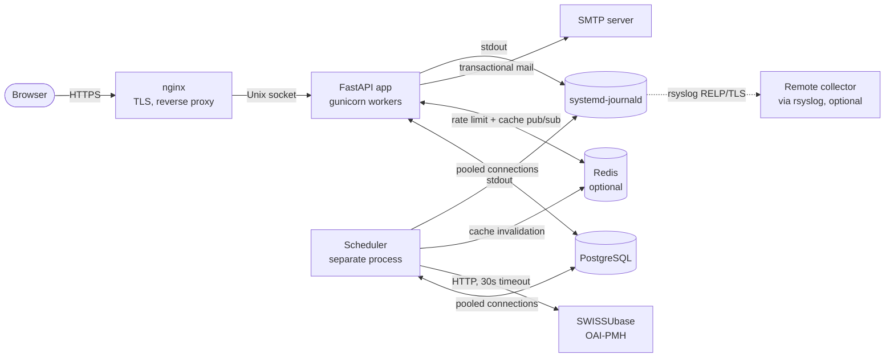
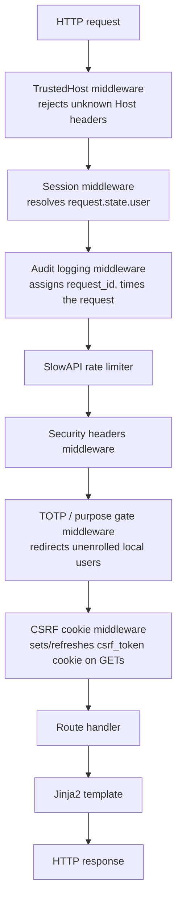

# Architecture Overview

The Oral History Archive is a server-rendered FastAPI web application backed by PostgreSQL, with a single outbound integration to a SWISSUbase OAI-PMH endpoint. This page is the entry point to the architecture track — it explains the moving parts at the highest level and points to the detail pages for each subsystem.

## The big picture

The browser only ever talks to nginx, which forwards to gunicorn over a Unix socket. There is no client-side JavaScript driving the UI — pages are rendered on the server with Jinja2. Two server processes run side by side: the **web application** (gunicorn workers) handles requests and sends transactional email; a **separate scheduler process** runs the OAI-PMH harvest and maintenance jobs and is the only thing that talks to SWISSUbase. Both processes log to stdout, captured by systemd-journald; audit logs can optionally be forwarded off-host by a host-level rsyslog agent.

## What lives where

| Layer | Location | Responsibility |
|---|---|---|
| Web entry point | `src/app/main.py` | FastAPI app construction, lifespan, middleware wiring, exception handlers |
| Server entry points | `run.py`, `run_scheduler.py` | Launch the web server / the standalone scheduler process |
| Routes | `src/app/routes/` | HTTP handlers — pages, auth, health |
| Middleware | `src/app/middleware/` | Cross-cutting request concerns — sessions, TOTP gate, CSRF, audit, headers, rate limit |
| Services | `src/app/services/` | Business logic and data access — datasets, users, sessions, sync, crypto, email |
| Templates | `src/app/templates/` | Jinja2 HTML |
| Configuration | `src/config/` | Pydantic Settings + structured logging |
| Migrations | `src/alembic/` | Schema versioning |
| Tests | `src/tests/` | 533 tests <!-- TODO(tests-rework): update this section once the new test suite lands --> |

The split is enforced by import direction: routes import from services and middleware, services import from each other and from `db.py` and `config`, middleware imports from `config` and (for the session middleware) from `services`. Services do not import routes; templates do not import Python beyond the helpers explicitly registered in `template_setup.py`.

## What happens at web startup

The lifespan handler in `main.py` does the following, in order, before the app accepts any requests:

1. **Configure logging.** `setup_logging()` installs the JSON or text formatter and the redaction filter; all logs go to stdout.
2. **Warn about unconsumed `.env` keys** (dev only). `warn_unconsumed_env_keys()` catches dead config and typos of real keys that `extra="ignore"` would otherwise swallow silently.
3. **Validate security settings and SMTP TLS.** `validate_security_settings()` checks every configured secret (`SECRET_KEY`, `SESSION_SECRET`, each `TOTP_ENCRYPTION_KEYS` entry, and — when set — `HEALTH_DETAIL_TOKEN` and `SHIBBOLETH_INTERNAL_SECRET`) for length, entropy, blocklist membership, and hardcoded defaults, plus the OAI URL scheme, the proxy/rate-limit combination, and credentialed-CORS origins. In staging/production, failures refuse startup; in dev they are logged as warnings. `verify_smtp_tls()` then exercises STARTTLS against the configured relay so a broken mail TLS setup fails here, not silently when a recovery email never arrives.
4. **Open the connection pool.** `create_pool()` returns a `psycopg_pool.AsyncConnectionPool`, opened and stashed on `app.state.db_pool`.
5. **Build the facet cache.** `FacetCache(pool)` is created and stored on `app.state.facet_cache`; it fills lazily on first access (and starts its Redis subscriber thread when Redis is enabled).
6. **Migrations.** In `dev`, Alembic upgrades the database to head automatically. In `staging`/`production`, the app does **not** migrate — it reads `alembic_version` and refuses to start unless the database is already at the head revision the code expects; migrations are run ahead of start by the systemd `ExecStartPre` (or manually).
7. **Validate the schema invariants.** `validate_dataset_schema()`, `validate_dataset_insert_schema()`, and `validate_user_schema()` assert the dataclasses and the column lists in `schema.py` / `users.py` are in sync; `assert_redaction_total()` asserts every `Dataset` field is classified as visible-or-redacted exactly once; and `validate_schema_against_db()` checks the live database actually has every column the code references. Any drift refuses startup with a clear error.
8. **Seed mock data in debug mode only.** Restricted-tier mock datasets are inserted so visibility filtering can be tested without real sensitive data. Skipped unless `FASTAPI_DEBUG=true` (and refused in production).
9. **Seed the admin user** if `ADMIN_SEED_EMAIL` and `ADMIN_SEED_PASSWORD` are set and no admin yet exists.

On shutdown, the facet cache's subscriber thread is stopped and the connection pool is closed.

The background scheduler is **not** started here. It runs in its own process (`run_scheduler.py`), which builds its own pool and facet cache and starts APScheduler. See [OAI-PMH Sync Pipeline](sync.md).

## How a request flows

Once the app is up, every incoming request passes through this pipeline (outermost first):

(When CORS is enabled, the `CORSMiddleware` sits innermost, between the CSRF cookie middleware and the route.)

The order matters and is enforced in `main.py` (where the last middleware added wraps the rest). Notable points:

- **TrustedHost is outermost**, rejecting unknown `Host` headers before any other layer spends cycles.
- **Session resolution runs early**, so every downstream layer — audit logging in particular — can read `request.state.user`. The session middleware only *resolves*; it does not enforce anything.
- **Audit logging is just inside the session layer and outside rate limiting**, so every request — including those rejected with 429 — produces an audit record with a `user_id`.
- **The TOTP/purpose gate is its own middleware**, registered *inside* the security-headers and audit layers. That placement is deliberate: the 303 redirects it issues pick up the standard security headers and land in the audit log, which an early return from the outer session middleware would bypass.
- **CSRF is implemented in two pieces.** The middleware refreshes the cookie on GETs. The actual verification is a *route-level dependency* (`Depends(verify_csrf)`) on each POST handler, so CSRF protection is visible in the route signatures and not invisible global state.
- **Security headers are applied in a bare `@app.middleware("http")` function** rather than `BaseHTTPMiddleware`. The same function adds `Cache-Control: no-store` to authenticated responses.

For a detailed walkthrough of one specific request — say, an authenticated GET on a restricted dataset detail page — see **[Request Lifecycle](request-lifecycle.md)**.

## Where data lives

| Table | Purpose |
|---|---|
| `oral_history_datasets` | Harvested dataset metadata, one row per dataset, with a JSONB blob holding the original record and two trigger-maintained, trigram-indexed search columns (`search_text_public`, `search_text_full`) |
| `users` | Local and Shibboleth-provisioned accounts: argon2 password hash, encrypted TOTP secret, access tier, admin/active/verified flags, lockout counters, and the hashed single-use tokens for password reset, email verification, and email change |
| `sessions` | Server-side session records — hashed ID, user ID, IP, expiry, purpose (`full` or `totp_setup`), optional flash message |
| `sync_status` | Singleton row (`id = 1`) with the last incremental harvest timestamp, the last full-rebuild timestamp, and the last sync error |

There are four application tables (plus Alembic's `alembic_version`). There is **no** separate `password_resets` table — reset, verification, and email-change tokens are stored as hashed columns on `users`.

The schema column lists are defined once in `services/schema.py` and re-used by `datasets.py`, `sync.py`, and `seed_mock_data.py`. Startup invariant checks catch drift between the SQL columns, the Python dataclasses, and the live database.

For the data model in more depth — the `Dataset` and `User` dataclasses, the orthogonal `access_level` vs `visibility_tier` distinction, and the relationships between tables — see **[Data Model](data-model.md)**.

## Where to read next

| To understand... | Read |
|---|---|
| ...how a single request becomes a response | [Request Lifecycle](request-lifecycle.md) |
| ...the dataset and user dataclasses, and what's in PostgreSQL | [Data Model](data-model.md) |
| ...how login, registration, TOTP, email verification, and sessions fit together | [Authentication & Sessions](auth.md) |
| ...how visibility tiers are enforced | [Access Control & Visibility](access-control.md) |
| ...how OAI-PMH harvesting works | [OAI-PMH Sync Pipeline](sync.md) |
| ...the layered security controls | [Security Layers](security.md) |
