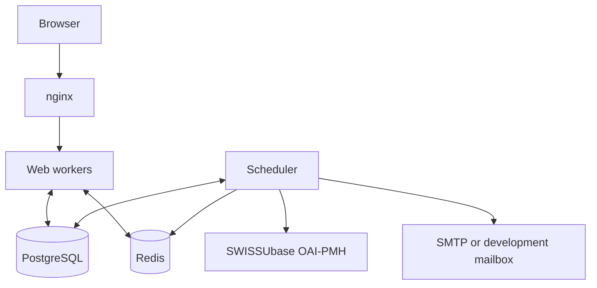

# Architecture Overview

FastAPI serves the catalogue from PostgreSQL. A separate scheduler harvests SWISSUbase metadata, delivers queued email, and runs maintenance.

## The big picture

The shipped deployment uses TLS at nginx and a Unix socket to Gunicorn. Jinja2 renders the UI. Web requests enqueue email; the scheduler delivers it. Hardened environments require a dedicated Redis rate-limit backend; catalogue-cache pub/sub uses separately configured, optional Redis. Both processes log to stdout. See [Deployment](../configuration/deployment.md) for proxy, service, and logging configuration.

## What lives where

| Location | Responsibility |
|---|---|
| `src/app/main.py` | Web startup, middleware, and error handlers |
| `run.py`, `run_scheduler.py` | Web and scheduler process entry points |
| `src/app/routes/`, `src/app/route_security.py` | Handlers and enforced route policies |
| `src/app/middleware/` | Admission, sessions, CSRF, auditing, and headers |
| `src/app/services/` | Authentication, storage, harvesting, email, and jobs |
| `src/app/templates/`, `src/app/static/` | HTML and static assets |
| `src/config/` | Settings and logging |
| `src/alembic/` | Database migrations |
| `src/tests/` | Unit, client, and integration tests |

## What happens at web startup

`app.main.lifespan` performs these steps before serving requests:

1. Configure logging and, in development, warn about unused `.env` keys.
2. Validate security settings, the route-policy inventory, and the rate-limit backend.
3. Load the password blocklist and warm the dummy Argon2 hash.
4. In development, upgrade Alembic to head. Hardened deployments migrate separately.
5. Open the database pool; validate schema and runtime-role contracts.
6. Reconcile the federation-policy fingerprint, revoking federated sessions when it is missing or changed.
7. Create the lazy catalogue cache and its optional Redis subscriber.
8. Seed development mock data when enabled, then seed the administrator when configured.

Shutdown stops the cache subscriber and closes the pool, including after startup failure. `run_scheduler.py` independently validates settings and schema, optionally seeds staging mock data, then starts the jobs. It does not run web migrations or administrator seeding. See [Deployment](../configuration/deployment.md) and [Sync](sync.md).

## How a request flows

Application middleware runs inbound in this order:

1. TrustedHost and optional CORS.
2. Audit logging.
3. Database-capacity error handling.
4. Bounded rate admission.
5. Session resolution and recovery-session restrictions.
6. Security headers and CSRF cookie maintenance.
7. Exact route-policy dependencies and the handler.

Rate-limit refusals precede session database work; audit wraps both. The database-capacity layer converts pool exhaustion into a retryable 503. Route dependencies enforce access, form Content-Type, and CSRF rules. Recovery sessions also have a middleware-level exact method/path restriction. See [Request Lifecycle](request-lifecycle.md).

## Where data lives

PostgreSQL stores catalogue rows, user credentials and authority, sessions, recovery-code generations, administrator invitations, outbox messages, sync state, and federation-policy state. Action-token hashes live on `users`; plaintext outbox bodies and TOTP secrets use separate encryption key rings.

[Data Model](data-model.md) defines the tables and redaction boundary. Runtime preflight checks application contracts, database schema, Alembic head, and process privileges before either process starts.

## Where to read next

| To understand... | Read |
|---|---|
| ...how a single request becomes a response | [Request Lifecycle](request-lifecycle.md) |
| ...the dataset and user dataclasses, and what's in PostgreSQL | [Data Model](data-model.md) |
| ...how login, registration, TOTP, email verification, and sessions fit together | [Authentication & Sessions](auth.md) |
| ...how visibility tiers are enforced | [Access Control & Visibility](access-control.md) |
| ...how OAI-PMH harvesting works | [OAI-PMH Sync Pipeline](sync.md) |
| ...the layered security controls | [Security Layers](security.md) |
