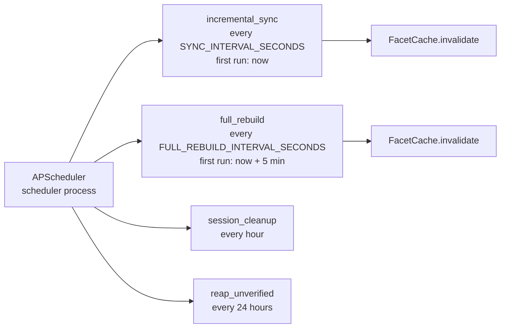
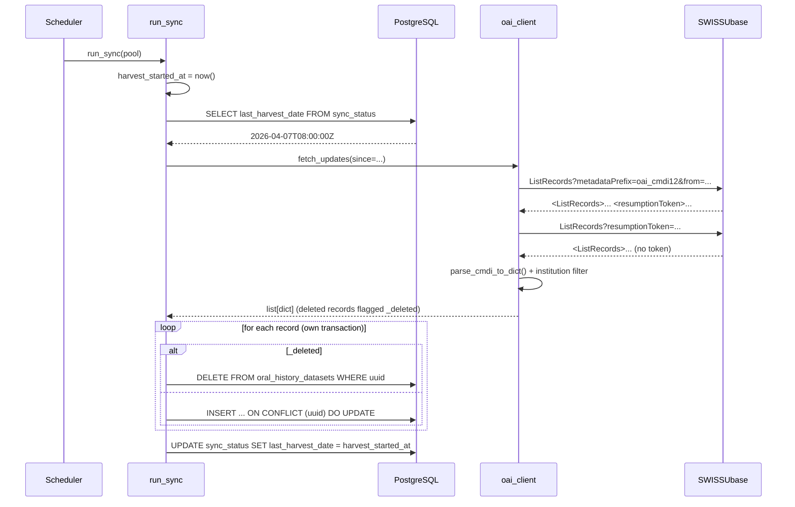

# OAI-PMH Sync Pipeline

The sync pipeline is what fills the local PostgreSQL cache with dataset metadata from external repositories. In Phase 1 the only source is SWISSUbase, accessed via the OAI-PMH protocol. This page walks through how that works end to end, what guarantees the pipeline gives, and where Phase 2 will plug in additional sources.

## Why a local cache at all?

The naive alternative would be to query SWISSUbase live on every search request. That fails for several reasons:

- **Latency.** OAI-PMH responses are XML and arrive in pages — searching across thousands of records would mean dozens of round trips per query.
- **Coupling.** Any SWISSUbase outage takes the archive down with it.
- **Search quality.** OAI-PMH is a harvesting protocol, not a search protocol. It has no concept of free-text query, faceting, or relevance.
- **Audit.** We want to log who looked at which dataset, which means the dataset has to be a stable local entity with a stable ID.

So instead, the application maintains a local mirror of the metadata in PostgreSQL and refreshes it on a schedule. The mirror is the source of truth for everything users see.

## The two operations

The pipeline supports two operations against each source:

1. **Incremental sync** — fetches only records modified since the last successful harvest, plus tombstones for deleted records. Cheap, runs frequently (default every hour).
2. **Full rebuild** — re-harvests everything for the source and replaces its rows. Expensive, runs rarely (default every 24 hours). It is necessary — not merely a recovery mechanism — because updated dataset versions get **new UUIDs and DOIs** upstream, with no link to the previous version and no reliable "modified" signal: only a periodic full rebuild can remove the stale predecessors.

The full rebuild is scoped by the `source` column in the database, so rebuilding Source A never touches Source B records or any locally seeded mock data.

## How it gets scheduled

The scheduler runs in a **dedicated process**, not inside the web app. `run_scheduler.py` builds its own connection pool and `FacetCache`, calls `create_scheduler(pool, facet_cache)`, and starts an APScheduler `AsyncIOScheduler`. In production this is the `oralhistarchiv-scheduler` systemd unit. Running it separately means the jobs fire once globally, not once per Gunicorn worker.

It owns four jobs:



The first incremental sync is scheduled for `now`, so a freshly started scheduler populates the mirror immediately; the first full rebuild is staggered five minutes later. Every job uses `max_instances=1`, so APScheduler refuses to start a second copy of *the same* job while a run is in progress.

That alone does **not** prevent the incremental sync and the full rebuild from interleaving with each other, so an explicit in-process `asyncio.Lock` (`_sync_mutex` in `scheduler.py`) serialises the two. The race it closes: an incremental sync deleting a tombstoned uuid concurrently with a rebuild re-inserting that uuid from its pre-deletion snapshot would resurrect a deleted record for up to a day. The in-process lock is sufficient because both jobs run on the one event loop of the dedicated scheduler process; if a second scheduler instance ever runs (HA), the source comments call for upgrading to `pg_try_advisory_lock`.

A lifecycle listener emits structured logs for job executions, errors, and missed runs, so scheduler health is visible in the journal.

After every sync (incremental or full), the `FacetCache` is invalidated. With Redis enabled, the invalidation is published over pub/sub so the web workers' caches clear too; without Redis the scheduler clears only its own (unused) copy and the web workers rely on the cache TTL.

## Inside an incremental sync

Once a sync job fires, control passes to `run_sync()` in `services/sync.py`, which currently delegates to `_sync_source_a()`:



A few details worth knowing:

- **Resumption tokens are handled inside the OAI client.** `_oai_list_records()` is a generator that yields one record element at a time and transparently follows resumption tokens. A safety cap of `OAI_MAX_PAGES` aborts a runaway pagination loop with a structured `OAIProtocolError` naming the last token.
- **The `from=` parameter is the key to incrementality.** It is filled with the `last_harvest_date` from the `sync_status` table, formatted as `YYYY-MM-DDTHH:MM:SSZ`. A fresh install starts from the sentinel `1900-01-01`, which is effectively a full harvest.
- **The watermark is the harvest *start* time, captured before the fetch.** Records modified mid-harvest are therefore re-fetched on the next run rather than missed; the upsert is idempotent by uuid, so the overlap is harmless. The watermark advances even when individual records fail — the periodic full rebuild re-fetches anything corrected upstream.
- **Deleted records are honoured.** Records whose OAI header carries `status="deleted"` come back as `{"_deleted": True, "uuid": ...}` and are deleted from the mirror.
- **`noRecordsMatch` is a normal outcome, not an error.** OAI-PMH returns it when nothing has changed since the `from` date. The client treats it as an empty iterator and the sync completes cleanly.
- **Institution filtering happens after parsing, not in the OAI request.** SWISSUbase has no institution-scoped harvest, so the client downloads everything and discards records whose CMDI metadata does not case-insensitively contain `OAI_INSTITUTION_FILTER`. Records with *no* institution field at all are also excluded, with a warning — an empty field usually signals CMDI-profile drift rather than a genuinely institution-less record.
- **Per-record resilience.** Each record is processed in its own transaction. A malformed record (or a `UniqueViolation` — including the special-cased DOI collision, where upstream mints a new uuid but reuses an existing DOI) is logged, skipped, and recorded; the sync continues with the next record.

## XML parsing and the XXE-hardened parser

CMDI is a CLARIN profile of XML with three relevant namespaces (`oai`, `cmd`, `cmdp`). The client uses `lxml` with a parser that has been deliberately locked down. A fresh parser is built per call (`_make_safe_parser()`) because lxml parsers are not thread-safe:

```python
def _make_safe_parser() -> etree.XMLParser:
    return etree.XMLParser(
        resolve_entities=False,   # blocks XXE expansion
        no_network=True,          # no DTD fetches
        dtd_validation=False,
        load_dtd=False,
    )
```

These four settings together prevent XML External Entity attacks even though the XML comes from a trusted source. The principle is *defense in depth*: SWISSUbase is trusted today, but a future Source B may be less so, and the parser configuration is shared.

The actual mapping from CMDI XPath expressions to dictionary keys lives in `parse_cmdi_to_dict()`. The result is a flat dict containing fields like `uuid`, `title`, `description`, `authors`, `keywords`, `languages`, `license_val`, `resource_proxies`, `institutions`, `main_disciplines`, and so on. Along the way it warns if the upstream CMDI profile has drifted from the expected one, validates every URL to the `http(s)` scheme allowlist (rejecting `javascript:` and friends before they can ever reach an `href`), and normalises DOIs (`doi:` prefix stripped; bare `10.x/...` or http(s) URLs accepted). Author and institution lists preserve upstream order (the lead author stays first); languages and keywords are deduplicated. From this point onwards the pipeline is database-shaped, not XML-shaped.

## Upserting

Each parsed record is upserted into `oral_history_datasets` with `INSERT ... ON CONFLICT (uuid) DO UPDATE SET ...`. The `uuid` column has a unique constraint, so the same dataset arriving twice — once from incremental sync, once from a full rebuild — produces a single row. A record without a uuid is rejected outright: uuid is the conflict key, and a NULL-uuid row could never be updated and would accumulate duplicates on every sync.

Two application-controlled fields are attached to every record on the way in:

- **`access_level`** comes from `_classify_access_level()`, which interprets SWISSUbase's free-text license labels (licenses starting with `"restricted access"`, case-insensitive, are `restricted`; everything else `public`). This is the only place those labels are interpreted; the function refuses to classify any non-SWISSUbase source, forcing future sources to define their own gating.
- **`visibility_tier`** comes from `resolve_tier(record_tier, policy)`, where the policy is the source's `SourcePolicy` — for SWISSUbase, `max_visibility = SWISSUBASE_MAX_VISIBILITY` (code default `vetted`, the most restrictive; a public-catalogue deployment sets it to `public`). A record can never be published more permissively than its source's ceiling; administrators can loosen or tighten individual records afterwards, directly in the database.

The full record dict is also stored in the JSONB `data` column. This is a deliberate redundancy: it preserves the raw harvest exactly as received, which is useful for debugging mapping bugs and for adding new flat columns later without re-harvesting.

## Full rebuild

`_full_rebuild_source_a()` fetches everything (from the sentinel date) **before** deleting anything — a failed fetch, or one that returns no live records, aborts the rebuild and preserves the existing data. It then deletes the source's rows and re-inserts, all inside a single transaction so the table is never observed empty; each record is additionally upserted inside its own `SAVEPOINT`, so a malformed record rolls back only itself and is recorded, while the rest of the rebuild still commits. On completion it updates both `last_full_rebuild_date` (the "data complete and consistent as of" marker shown on the home page) and `last_harvest_date` (the incremental cursor — a rebuild has fetched everything up to its start time, so the next incremental sync continues from there).

## Error handling

If the **fetch** step fails, the pipeline logs the exception, writes a sanitised message (file paths and stack frames stripped, length-capped) with a timestamp into `sync_status.last_sync_error` / `last_sync_error_at`, and returns control to the scheduler — the failure does not bring down anything or block subsequent jobs. **Per-record** failures during an otherwise successful run are aggregated into the same fields (the first 20 uuid/message pairs plus a count). A subsequent clean run clears the error fields. The `/health/detail` endpoint surfaces the most recent error, so operators can spot a stuck sync without trawling logs.

There is no automatic retry inside the sync function itself (the HTTP layer retries transient 429/5xx responses with backoff, but a failed run is not re-run). The next scheduled run is the retry. With the default one-hour interval this is the right tradeoff: SWISSUbase outages are typically transient, and tight retry loops would only amplify upstream pressure.

## Schema invariant

The list of columns the application reads from and writes to `oral_history_datasets` lives in exactly one place: `services/schema.py`. Both `datasets.py` (which selects) and `sync.py` (which inserts) consume it. At startup, `validate_dataset_schema()` asserts the SELECT column list and the `Dataset` dataclass fields agree (minus the computed `download_url` / `landing_page_url`), `validate_dataset_insert_schema()` asserts the INSERT list is `DATASET_COLUMNS` followed by exactly `data`, `last_modified`, and `validate_schema_against_db()` confirms the live database actually has every expected column.

This is a guard against the most common type of bug in this kind of code: adding a field to the dataclass and forgetting it in the query, or vice versa. If they drift, the application refuses to start.

## Phase 2 plug-in points

Source B will plug in at the `run_sync` and `run_full_rebuild` level, not inside `_sync_source_a`. The intended structure (the Source B branch is stubbed out in the source):

```python
def run_sync(pool):
    _sync_source_a(pool)
    _sync_source_b(pool)   # Phase 2

def run_full_rebuild(pool):
    _full_rebuild_source_a(pool)
    _full_rebuild_source_b(pool)   # Phase 2
```

Source B will have its own client module (not yet written), its own filter, its own access-level rules (the `_classify_access_level` guard forces that), and — crucially — its own `SourcePolicy` with an appropriately restrictive `max_visibility` ceiling. It writes to the same `oral_history_datasets` table but tags each row with a distinct `source`, so the existing `_delete_source_records()` helper can rebuild it independently.

The visibility-tier story is therefore source-aware by design: a record's *initial* tier is derived from its source's policy ceiling at ingest, and administrators adjust individual records afterwards. Adding a source without an explicit sensitivity decision is impossible — `SourcePolicy.max_visibility` has no default.
