# Deployment

This page is a high-level overview of how the application is meant to be deployed in production. The full step-by-step runbook with exact commands, file contents, and configuration snippets lives in **`Deployment.md`** at the repository root. That document is the operational source of truth; this page summarises the architecture and tells you what each piece is for.

## Target environment

The reference deployment target is a single Ubuntu 22.04 or 24.04 LTS virtual machine on the University of Zurich LeoMed infrastructure, with:

- nginx terminating TLS on the public interface
- Gunicorn running the FastAPI application as a systemd service under a dedicated unprivileged user
- A **separate** scheduler systemd service running the OAI-PMH syncs and maintenance jobs
- PostgreSQL 15+ on the same host
- Redis on the same host (rate limiting and facet-cache invalidation across workers)
- Shibboleth SP installed for federated authentication (Phase 2)
- Logs to systemd-journald, with optional shipping to a remote syslog collector

## Component map

```mermaid
flowchart TB
    subgraph Internet
        client[Browser]
    end

    subgraph VM[Ubuntu LTS VM &#40;LeoMed&#41;]
        nginx[nginx<br/>TLS, Shibboleth SP, static files]
        gunicorn[oralhistarchiv.service<br/>Gunicorn workers &#40;FastAPI&#41;]
        scheduler[oralhistarchiv-scheduler.service<br/>APScheduler process]
        pg[(PostgreSQL 15+)]
        redis[(Redis)]
        journal[(systemd-journald)]
    end

    subgraph External
        swiss[SWISSUbase OAI-PMH]
        smtp[SMTP relay]
        syslog[Remote collector]
    end

    client -->|HTTPS 443| nginx
    nginx -->|Unix socket| gunicorn
    gunicorn --> pg
    scheduler --> pg
    gunicorn <--> redis
    scheduler --> redis
    scheduler --> swiss
    gunicorn --> smtp
    gunicorn -->|stdout| journal
    scheduler -->|stdout| journal
    journal -.->|rsyslog, RELP over TLS| syslog
```

## Why this shape

A few of the choices in the reference deployment are non-obvious and worth motivating.

### Single VM, not Kubernetes

Phase 1 traffic is small, the team is small, and the data is hosted by a university IT department with a strong preference for VMs over orchestrated containers. The application scales up first (more Gunicorn workers, beefier VM) before scaling out; a horizontal-scale story is Phase 2 work.

### Two systemd units: web and scheduler

The web app and the background scheduler run as **separate** systemd services (`oralhistarchiv.service` and `oralhistarchiv-scheduler.service`). Running the scheduler in its own process means the OAI-PMH syncs and maintenance jobs fire once globally rather than once per Gunicorn worker. The scheduler has no HTTP surface; it is monitored via `systemctl is-active` and the `sync_status` table.

### Gunicorn over a Unix socket

The FastAPI process binds to a Unix socket in `/run/oralhistarchiv/`, never to a TCP port. There is no way to reach the application from outside the host without going through nginx, even if a firewall rule is misconfigured. This is also the foundation of the Shibboleth trust model (below).

### Redis for shared state

Redis backs slowapi's rate-limit counters (so limits are global across workers, not per-worker) and the facet-cache pub/sub invalidation (so a sync in the scheduler process clears the cache in every web worker). Redis holds only ephemeral coordination state and is deliberately not backed up. Without Redis, the gunicorn config drops to a single worker so rate limiting stays correct.

### nginx in front, with the Shibboleth SP at the edge

nginx is what UZH IT operates and audits. When Shibboleth comes online in Phase 2, the SP runs at the nginx layer and forwards attribute headers (`REMOTE_USER`, `mail`, `displayName`, `affiliation`, and the configured country header) plus the `X-Internal-Auth` secret on the callback path only — and strips all of them everywhere else. The application trusts these headers only when `SHIBBOLETH_ENABLED=true` **and** the `X-Internal-Auth` value matches `SHIBBOLETH_INTERNAL_SECRET` (constant-time compare; the secret is mandatory whenever Shibboleth is enabled). There is no IP-based trust: the callback outright refuses any request that arrives with a TCP peer, because in this deployment legitimate requests only ever arrive over the Unix socket. This keeps the SAML implementation outside the Python process.

### Logs to journald

The application writes structured logs to stdout; systemd-journald captures both the web and scheduler streams and handles rotation/retention (configured in `/etc/systemd/journald.conf.d/oralhistarchiv.conf`). This is multi-process safe, unlike file-based rotation. For off-host retention, a host-level rsyslog agent forwards journald output over RELP/TLS (see `deploy/rsyslog-oralhistarchiv.conf.example`).

## What the runbook covers

`Deployment.md` is organised into 17 sections:

1. Prerequisites
2. VM setup and hardening — `unattended-upgrades`, SSH hardening, fail2ban, dedicated user
3. PostgreSQL — install, role and database, authentication
4. Redis — install, loopback-only bind, no persistence
5. Application installation — clone, venv, dependency install
6. Environment configuration — generating secrets and the `.env`
7. Gunicorn, scheduler & systemd — both unit files, starting and verifying the two services
8. nginx and SSL — server block, certificate, header injection/stripping
9. Shibboleth SP — installation and SWITCH AAI registration (Phase 2)
10. Firewall — `ufw` rules
11. Backups — `pg_dump` schedule, retention, restore
12. Log management — journald retention, scrubbing, querying
13. Monitoring — health endpoints, scheduler liveness
14. Memory tuning — `MemoryMax` per unit
15. CI/CD — a template GitHub Actions workflow
16. Post-deployment checklist
17. Maintenance — updates, migrations, secret rotation, emergency procedures

For secret rotation specifically — including the delicate `TOTP_ENCRYPTION_KEYS` re-encryption procedure — follow the **[Key-Rotation Runbook](../runbooks/key-rotation.md)**.

## First-deployment checklist (short version)

Follow `Deployment.md` end to end. The essentials:

- [ ] PostgreSQL is reachable and the dedicated database exists
- [ ] Redis is installed, bound to loopback, and `REDIS_ENABLED=true`
- [ ] `SECRET_KEY`, `SESSION_SECRET`, `TOTP_ENCRYPTION_KEYS`, `HEALTH_DETAIL_TOKEN`, and (if Shibboleth) `SHIBBOLETH_INTERNAL_SECRET` were generated, not copied
- [ ] `ENV_STATE=production` is set as a real OS environment variable; `FASTAPI_DEBUG=false`
- [ ] `PUBLIC_BASE_URL` is the public `https://` URL (emailed links are built from it)
- [ ] `ALLOWED_HOSTS` lists the public hostname
- [ ] `SMTP_ENABLED=true` with real credentials (otherwise reset/verification mail is only logged)
- [ ] `RATE_LIMIT_TRUST_PROXY=true` and `TRUSTED_PROXY_IPS` is correct
- [ ] *(optional hardening)* `/health/detail` additionally IP-restricted at the nginx layer — a commented snippet ships in `deploy/nginx.conf.example`; uncomment it and set your monitoring range(s)
- [ ] Both `oralhistarchiv.service` and `oralhistarchiv-scheduler.service` are enabled and running
- [ ] The scheduler log shows "Scheduler started" and a sync; the web log does **not** contain scheduler messages
- [ ] An admin was seeded with `ADMIN_SEED_*`, and the seed values were removed after first login
- [ ] `pg_dump` cron is in place; journald retention config is installed

## Upgrades

The upgrade flow is:

1. Pull the new code and re-install dependencies into the venv.
2. Run migrations: `alembic upgrade head`. In production this is run explicitly (the systemd unit runs it as `ExecStartPre`, or you run it manually) — the web app does **not** auto-migrate outside `dev`; it only verifies the schema version on start and refuses to run against a mismatched database.
3. Restart both services: `sudo systemctl restart oralhistarchiv oralhistarchiv-scheduler`.

If a migration is destructive or requires extended downtime, follow the "Maintenance mode (planned downtime)" steps in `Deployment.md` §17: stop both services, have nginx answer 503, migrate, then restart.

## Rollback

Because migrations are run explicitly, a rollback usually means:

1. Take the services into maintenance.
2. Run `alembic downgrade <previous_revision>`.
3. Deploy the previous code.
4. Restart both services.

The dataset table is recoverable from a full rebuild against SWISSUbase, so a corrupted dataset cache does not require a backup restore. The `users` and `sessions` tables are *not* recoverable from upstream and must come from `pg_dump` backups. (Reset/verification tokens live as columns on `users`; there is no separate token table to restore.)
