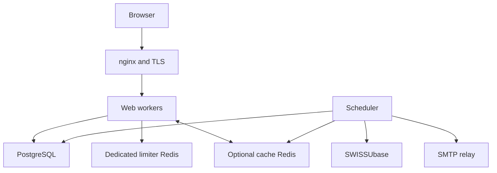

# Deployment

This page is a high-level overview of how the application is meant to be deployed in production. The full step-by-step runbook with exact commands, file contents, and configuration snippets lives in **`Deployment.md`** at the repository root. That document is the operational source of truth; this page summarises the architecture and tells you what each piece is for.

## Target environment

Follow [Deployment.md](../../Deployment.md) for the reference Ubuntu host:
Python 3.11, PostgreSQL 16, nginx/TLS, isolated web/scheduler identities, a
dedicated persistent Redis limiter, and optional separate cache Redis. Backup
uses a read-only identity and age encryption; producer authenticity depends on
authenticated transfer and separately controlled retention.

## Component map



Web workers enqueue mail in PostgreSQL; the scheduler delivers it. Journald
collects process logs; optional rsyslog forwarding is host configuration.

## Why this shape

A few of the choices in the reference deployment are non-obvious and worth motivating.

### Single VM

The supplied units and paths target one host. Multi-host deployment requires
separate review of scheduler ownership, database roles, secrets and proxy trust.

### Two systemd units: web and scheduler

The web app and the background scheduler run as **separate systemd services
and separate OS identities** (`oralhistarchiv.service` and
`oralhistarchiv-scheduler.service`). Running the scheduler in its own process
means the OAI-PMH syncs and maintenance jobs fire once globally rather than
once per Gunicorn worker. The distinct UID is also load-bearing: a compromised
scheduler must not inherit the web user's access to the proxy socket or the
web-only Shibboleth secret. The scheduler has no HTTP surface; it is monitored
via `systemctl is-active` and the `sync_status` table.

### Gunicorn over a Unix socket

The FastAPI process binds to a Unix socket in `/run/oralhistarchiv/`, never to
a TCP port. The shipped units make the parent directory
`oralhistarchiv:oralhistarchiv-proxy` mode `0750`; Gunicorn creates the socket
with the same ownership and mode `0660`. Only the web identity and nginx's
verified worker identity may access that group. The scheduler has a distinct UID and
an explicit `InaccessiblePaths=-/run/oralhistarchiv`. Those exact ownership,
mode, group-membership, and no-TCP-listener facts must be verified on the host;
the source files alone do not establish the deployed boundary. The proxy UID
must run only the intended nginx workers: on a shared host, PHP-FPM or another
service under `www-data` would inherit socket access. Inventory its live
processes or use a dedicated nginx worker identity/instance.

### Redis for shared state

The dedicated limiter Redis backs slowapi's security counters across workers.
It has its own ACL, no-eviction policy and AOF so ordinary restarts retain live
quotas; it is excluded from backups. A separate, optional general Redis handles
best-effort catalogue-statistics pub/sub. With no dedicated limiter URL, development
uses a single Gunicorn worker. Hardened web startup requires the dedicated
limiter regardless of the general Redis setting.

### nginx in front, with the Shibboleth SP at the edge

nginx is what UZH IT operates and audits. In Phase 1 the exact
`/auth/shibboleth/callback` location returns `404`, does not proxy to the
application, and `SHIBBOLETH_INTERNAL_SECRET` remains unset.

When Shibboleth comes online in Phase 2, the SP runs at the nginx layer. The
FastCGI authorizer must populate and nginx must overwrite the fixed private
headers `X-OHA-Shib-Subject`, `X-OHA-Shib-Issuer`, `X-OHA-Shib-Mail`,
`X-OHA-Shib-Display-Name`, `X-OHA-Shib-Affiliation`, `X-OHA-Shib-Country`,
and `X-OHA-Shib-Authn-Context`, plus `X-OHA-Internal-Auth`, on the exact
callback location. Ordinary proxy locations clear all of these and the legacy
Shibboleth header names; client input is never forwarded as identity data.
The callback explicitly sets `satisfy all` (so an inherited access-policy
setting cannot make the Shibboleth authorizer optional),
`shib_request_use_headers off` (so the nginx module cannot copy ambient request
headers into its attribute namespace), and `proxy_pass_request_headers off`
(so the client header set does not reach the application), then forwards only
the reviewed explicit values.

The application then requires all of the following: `SHIBBOLETH_ENABLED=true`,
a constant-time match with `SHIBBOLETH_INTERNAL_SECRET`, an absolute HTTPS
issuer exactly in `SHIBBOLETH_TRUSTED_ISSUERS`, and the exact REFEDS MFA context
`https://refeds.org/profile/mfa`. There is no IP-based trust: the callback
refuses any request that arrives with a TCP peer because legitimate requests
arrive over the Unix socket. That check is only a topology tripwire; nginx-only
socket permissions, the SP authorizer, header replacement, and secret custody
are the actual trust boundary.

A first accepted assertion is not a login. It creates an inactive, public,
non-admin, unverified pending row keyed by `(issuer, subject)` and issues no
session. An administrator must use the dedicated approval action, which
re-matches that exact pair, assigns the selected tier, activates the row, and
records approval actor/time, bumps `auth_revision`, and deletes every target
session atomically. Generic tier/admin/reactivation actions cannot release
pending or legacy-quarantined identities. Only a later matching assertion can
log in.

Federated session eligibility is also fail-closed after login. Each lookup
requires the flag, active/approved state, and a still-trusted exact issuer.
Startup stores a fingerprint of the flag, sorted issuer list, fixed MFA
context, policy version, and callback secret; a missing or changed fingerprint
revokes every Shibboleth session in the same transaction that records the new
digest. Local sessions are untouched.

### Logs to journald

The application writes structured logs to stdout; systemd-journald captures both the web and scheduler streams and handles rotation/retention (configured in `/etc/systemd/journald.conf.d/oralhistarchiv.conf`). This is multi-process safe, unlike file-based rotation. For off-host retention, a host-level rsyslog agent forwards journald output over RELP/TLS (see `deploy/rsyslog-oralhistarchiv.conf.example`).

### Encrypted backups under a separate identity

The backup timer does not run as either application user and does not read the
root-owned `/etc/oralhistarchiv` environment files. A dedicated read-only PostgreSQL role passes an explicit
database/schema preflight, then streams a custom-format dump directly through
`age` inside a `0700` systemd state directory. No plaintext dump is written to
a filesystem; only a `0600` encrypted `*.dump.age` file is atomically published.
The private identity is held off-host under separate recovery custody.
PostgreSQL custom format is not itself encryption, and `age` recipient
encryption does not authenticate who produced an archive. The deployment
runbook's filesystem, authenticated-transfer/provenance, failure, monitoring,
off-host-copy and isolated-restore checks are mandatory host controls, not
properties the application can verify at startup.

## Operational procedures

Use [Deployment.md](../../Deployment.md) for installation, configuration,
preflight, backup/restore, monitoring and maintenance. Use [key rotation](../runbooks/key-rotation.md)
for signing/session credentials, TOTP re-encryption, outbox-key retention and
backup-key custody. The encrypted systemd timer workflow creates age archives;
its private identity is held off-host.

## First-deployment checklist

Complete the acceptance checklist in [Deployment.md](../../Deployment.md#16-post-deployment-checklist).
The migration unit must report static and inactive, not enabled; web/scheduler
use their own non-owner roles. Keep public registration and federation closed
until their respective release gates pass. A fresh schema is supported;
existing prototype databases require a reviewed migration/import plan.


## Upgrades

Production runtime processes never run Alembic. Follow `Deployment.md` - "17. Maintenance":
enter nginx maintenance, stop web and scheduler, take and verify an encrypted
backup, review migrations and `database-runtime-grants.sql` together, start the
static/manual `oralhistarchiv-migrate.service`, confirm its journal and
Alembic head, then start scheduler and web and require both exact runtime-role
preflights before restoring traffic.

## Rollback

There is no generic production `alembic downgrade` command. Every
schema-changing release must ship a reviewed forward-repair or restore plan.
Run it through an equivalently sandboxed owner-only one-shot while web and
scheduler remain stopped, reapply the matching deny-first grant manifest,
deploy matching application code, and require both runtime preflights before
reopening traffic. Never run `alembic` as a runtime OS/DB identity. The
federation-specific rollback ordering in `Deployment.md` - "9. Shibboleth SP" 
still takes precedence.


## Terminal email retention and delivery monitoring

The scheduler runs `outbox_retention` every `OUTBOX_RETENTION_INTERVAL_SECONDS` (60 by default). It deletes sent messages older
than `OUTBOX_SENT_RETENTION_DAYS` (default 7) and dead messages older than
`OUTBOX_DEAD_RETENTION_DAYS` (default 30), using their terminal timestamps.
Each run deletes at most `OUTBOX_RETENTION_BATCH_SIZE` rows per status
(default 1000; at most twice the configured batch size total). Pending and sending messages are preserved.
Oldest eligible rows are processed first; locked rows wait for a later run.
There is no automatic replay of dead messages: request a new action email
through the relevant account flow. Purged bodies and per-message diagnostics
cannot be recovered from the live database.

Monitor authenticated `/health/detail` JSON, not just its HTTP status. Its
`checks.outbox` object exposes pending/sending/dead counts, oldest pending
and sending ages, and a retention-overdue count. Stalled messages at
`OUTBOX_STALE_AFTER_SECONDS` (default 600), unavailable outbox diagnostics,
or terminal rows overdue by more than two hours make the overall status
`degraded` while HTTP remains 200. A nonzero dead count is informational:
also uses `dead` for expected cancellations. Inspect scheduler logs
for failed `outbox_retention` runs and successful `outbox_retention` events
with `sent_deleted` and `dead_deleted` counts. Sustained growth in overdue
rows means cleanup is failing or its bounded throughput is insufficient;
raise the batch size within its 5000-row per-status limit after checking load.

Retention does not itself prove an old `OUTBOX_ENCRYPTION_KEYS` entry is
unused: pending/sending bodies, retained terminal bodies, and backups may
still need it. Follow the key-rotation runbook before removing a key.

## Scheduler shutdown budget

`run_scheduler.py` allows 300 seconds for running jobs to drain, then a
5-second cancellation grace. The scheduler unit sets `TimeoutStopSec=330s`,
leaving 25 seconds for cleanup. Keep these paired values aligned; the
`src/tests/unit/test_deployment_units.py` test checks their relationship.
`KillMode=mixed` sends the initial stop signal to the scheduler, allowing it
to drain or terminate its SMTP child. `SendSIGKILL=yes` retains systemd's
final group-wide forced stop if graceful shutdown fails.

After installing the revised unit, reload and inspect the effective settings:

```bash
sudo systemctl daemon-reload
systemctl show oralhistarchiv-scheduler.service \
    --property=TimeoutStopUSec --property=KillMode --property=SendSIGKILL
```

Expected values: a 330-second stop timeout (commonly displayed as `5min 30s`),
`KillMode=mixed`, and `SendSIGKILL=yes`. Check local drop-ins if they differ.
A restart can now wait for that drain budget; plan deployment timing accordingly.

## Installing the application wheel

Ordinary non-editable wheel installations are supported. Hatch packages the
single source migration repository (`src/alembic/` and `src/alembic.ini`)
inside `app/_migration_assets/`; do not maintain a second hand-copied tree.
Runtime paths prefer the packaged assets and only use the old source paths
in a detected source checkout. Direct zip-import is unsupported.

The packaged migration CLI may be called directly only in development. In
staging/production, install the release's unit and migration assets and invoke
the CLI exclusively through the static/manual
`oralhistarchiv-migrate.service`; the unit supplies `migration.env`, quiesces
both runtime units through `Conflicts=`, and reapplies the reviewed runtime
grants. Never add Alembic to a runtime unit's `ExecStartPre` and never load
`migration.env` into a wheel-only web or scheduler process.
