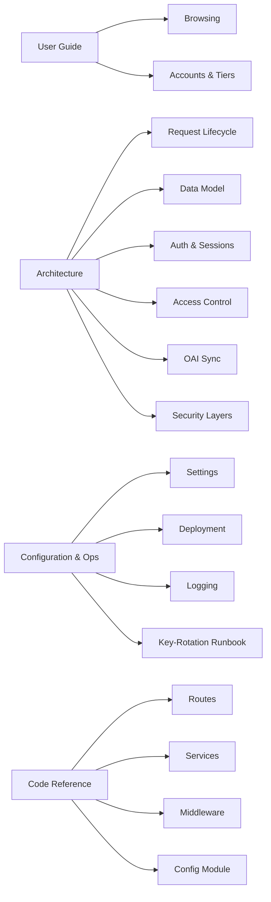

# Oral History Archive Documentation

Welcome to the documentation for the **Digital Oral History Archive**, a search and access portal for oral history research datasets developed at the University of Zurich.

This site is the single source of truth for everything beyond the README: how the application is meant to be used, how it is built internally, how to configure and deploy it, and a complete code reference generated from the source.

---

## Who is this for?

The documentation is organised by audience. Pick the section that matches what you are trying to do.

### I want to use the archive

You are a researcher, student, or member of the public who wants to find oral history datasets.

→ Start with the **[User Guide](user-guide/overview.md)**. It explains what the archive is, how to search and browse, what the different access tiers mean, and how to register an account.

### I am a developer working on the codebase

You are joining or maintaining the project and need to understand how it fits together.

→ Start with **[Architecture → Overview](architecture/overview.md)** for the big picture, then drill into the subsystem pages for auth, sync, access control, and security. The **[Code Reference](reference/main.md)** section is generated directly from docstrings and is the right place when you need exact signatures.

### I am deploying or operating the application

You need to install, configure, monitor, or upgrade a running instance.

→ Start with **[Configuration → Settings Reference](configuration/settings.md)** for every environment variable, then **[Deployment](configuration/deployment.md)** for the production runbook, and **[Logging & Audit](configuration/logging.md)** for what the application records and how to ship it elsewhere. For rotating any secret — including the delicate `TOTP_ENCRYPTION_KEYS` procedure — follow the **[Key-Rotation Runbook](runbooks/key-rotation.md)**.

---

## What you will find here

The **User Guide** is task-oriented. The **Architecture** section is conceptual and explains *why* the code looks the way it does. The **Configuration & Operations** section is reference material for running the system, and the **runbooks** are step-by-step operator procedures. The **Code Reference** is generated from docstrings and is the most precise but least readable layer — use it when you need to know exact arguments and types.

---

## Project context

The Oral History Archive is a Phase 1 prototype that:

- Harvests dataset metadata from external repositories via the OAI-PMH protocol
- Stores it in a local PostgreSQL cache
- Serves it through a server-rendered FastAPI / Jinja2 web interface
- Enforces tiered metadata visibility so that sensitive fields are only shown to users authorised to see them

It is designed from the start to handle sensitive research data in Phase 2. That is why authentication, TOTP, encrypted secrets at rest, CSRF, strict CSP, and audit logging are already in place even though no truly sensitive data flows through Phase 1 yet.

For the current development status and what is on the horizon, see the project `roadmap.md` in the repository root.
