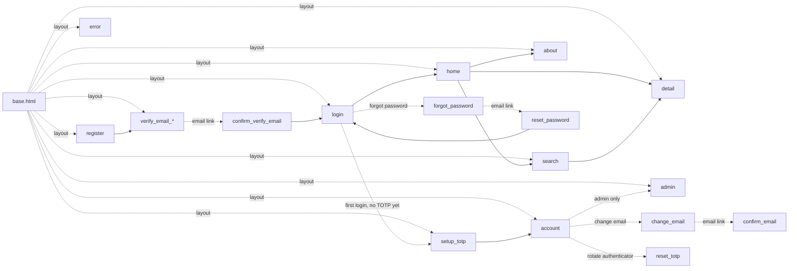

# HTML Templates

This page is the catalogue of every Jinja2 template the application renders. Templates are organised into three groups: the **layout chrome**, the **public pages**, and the **authenticated pages**. Within each group the templates are listed in roughly the order a user would encounter them.

All templates extend `base.html` and have access to the same set of globals registered in `app/template_setup.py`: the `request` object, `csrf_token(request)`, the `url_for_query` and `can_view_full` helpers, and the `contact_email`, `is_production`, and `shibboleth_enabled` values. A `safe_url` filter is also registered, which strips any URL whose scheme is not `http(s)`. Auto-escaping is enabled by default, so any user-provided value rendered with `{{ ... }}` is HTML-escaped before reaching the browser.

## Layout chrome

### `base.html`

The single layout file every other template extends. It defines the `<!doctype>`, the `<head>` (CSS, fonts, viewport, CSP-friendly metadata), the navigation header, the footer, and `` for child templates to fill.

The navigation header is identical on every page. When the user is logged in, the **Login** link is replaced with the user's display name and a **Logout** control (rendered as a CSRF-protected POST form, not a plain link), and an **Admin** link appears when `request.state.user.is_admin` is true.

```html
--8<-- "src/app/templates/base.html"
```

### `error.html`

Rendered by all four exception handlers in `main.py` (404, 422, 500, generic `Exception`), and also by `pages.detail` for missing dataset IDs. Takes optional `error_title` and `error_message` template variables; falls back to a generic message if neither is supplied. No internal details are ever rendered to the user.

```html
--8<-- "src/app/templates/error.html"
```

## Public pages

### `home.html`

The landing page. Shows three pieces of information:

- A small "collection at a glance" panel with total dataset count, total languages, and total keywords
- A grid of the most recent datasets (filtered for the current user's tier)
- The date the catalogue was last fully reconciled with the source

```html
--8<-- "src/app/templates/home.html"
```

### `search.html`

Paginated search results with the facet sidebar. The form fields preserve their values across navigation via `url_for_query`, so changing the page in pagination keeps the active query, keyword, language, and access level filters intact.

Each result card shows the title, the authors, a truncated description, and badges for the languages and access level. Results restricted by visibility tier appear with their title only and a small badge indicating the required tier.

```html
--8<-- "src/app/templates/search.html"
```

### `detail.html`

A single dataset's full metadata page. The template branches on whether the user has access to the full dataset or only the redacted view — the redaction itself happens server-side in `filter_for_tier()` before the dataset reaches the template, so the template only needs to handle the empty-field case gracefully.

```html
--8<-- "src/app/templates/detail.html"
```

### `about.html`

A static page with project context, contact information (`contact_email`), and links to the upstream sources.

```html
--8<-- "src/app/templates/about.html"
```

## Authenticated pages

### `login.html`

The login form. Handles both local-credential login (email + password + TOTP code) and a **Login with SWITCH edu-ID** button when `shibboleth_enabled` is true. Renders error messages above the form on failed attempts; preserves the email field across rerenders so users do not have to retype it. Status code is 401 on a failed attempt.

```html
--8<-- "src/app/templates/login.html"
```

### `register.html`

Registration form for local accounts. Collects email, display name, optional affiliation and country, and password. Does **not** collect TOTP — that happens after the first login on `setup_totp.html`. On a validation failure it renders a single error banner above the form (field values are preserved so nothing has to be retyped).

```html
--8<-- "src/app/templates/register.html"
```

### `send_verification.html`

The form for requesting a fresh email-verification link. Like the forgot-password page, it always responds with the same generic message regardless of whether the address exists or is already verified, so it cannot be used to enumerate accounts.

```html
--8<-- "src/app/templates/send_verification.html"
```

### `verify_email_pending.html`

The "check your email" page. Rendered immediately after registration (no session is created at that point), and again if an unverified user reaches `/setup-totp` before clicking the link. Explains that a verification email has been sent and offers the resend option.

```html
--8<-- "src/app/templates/verify_email_pending.html"
```

### `confirm_verify_email.html`

The destination of the verification link (`GET /verify-email/{token}`). Shows a single confirm button that POSTs the token — the GET itself does not consume it, so a mail scanner following the link cannot burn the single-use token. Pressing the button completes verification and redirects to the login page.

```html
--8<-- "src/app/templates/confirm_verify_email.html"
```

### `setup_totp.html`

The TOTP enrolment screen. Shows the QR code (generated server-side and embedded as a `data:` URI), the matching secret in text form for users whose authenticator app does not support QR scanning, and a verification field where the user enters the first six-digit code.

A new local user lands here after their **first login** — registration itself creates no session. Logging in with password only (no authenticator enrolled yet) yields a `purpose='totp_setup'` session that can only reach the verification, TOTP-setup, and logout paths. Until the email is verified, this page shows the "verify your email first" state instead of the QR code. After the verification code is accepted, the session is upgraded to `purpose='full'` and the user is redirected to their account page.

```html
--8<-- "src/app/templates/setup_totp.html"
```

### `account.html`

The user's own account page. Shows email, display name, affiliation, country, access tier, account creation date, last login, and TOTP enrolment status. From here the user can update their display name, change their email address (a confirmation link is sent to the new address before the change takes effect), and rotate their authenticator. Requesting a higher access tier is still done out of band by contacting the administrators.

```html
--8<-- "src/app/templates/account.html"
```

### `change_email.html`

The self-service email-change form, reached from the account page. The user enters a new address; a confirmation link is sent to it (and a notice to the old address), and the change only commits when the link is clicked.

```html
--8<-- "src/app/templates/change_email.html"
```

### `confirm_email.html`

The destination of the email-change confirmation link (`GET /account/confirm-email/{token}`) — the same safe-GET / consuming-POST pattern as `confirm_verify_email.html`. Pressing the confirm button commits the new address and ends the account's sessions.

```html
--8<-- "src/app/templates/confirm_email.html"
```

### `reset_totp.html`

The self-service "change my authenticator" screen at `/account/reset-totp`. The user must supply a code from their **current** authenticator together with a code from the **new** one; only then is the new secret promoted. This is not an admin-initiated flow — a user who has lost their authenticator entirely (and so cannot supply a current code) must contact an administrator.

```html
--8<-- "src/app/templates/reset_totp.html"
```

### `forgot_password.html`

The "I forgot my password" form. Asks for an email address and always responds with the same success message regardless of whether the address corresponds to an existing account — the no-enumeration property of the password reset flow is enforced at this template + route boundary.

```html
--8<-- "src/app/templates/forgot_password.html"
```

### `reset_password.html`

The destination page for password reset email links. Validates the token before showing the form (so a tampered or expired token gets a clear error) and presents a new-password field with the same validation rules as registration: minimum length, no common-password match, no email or display-name substring.

```html
--8<-- "src/app/templates/reset_password.html"
```

### `admin.html`

The admin dashboard. Lists all users with their email, display name, affiliation, access tier, admin flag, active flag, and last login. Provides forms for tier changes, deactivation (which also revokes the user's sessions immediately), admin promotion, and staging an email change. Every action is a CSRF-protected POST and is recorded in the audit log.

Only reachable when `request.state.user.is_admin` is true; the router enforces this via `Depends(require_admin)`, which returns 404 for everyone else.

```html
--8<-- "src/app/templates/admin.html"
```

## Template flow

A simplified map of how the user moves between templates.


