# Browsing & Searching

## The home page

The home page shows the size of the collection (number of datasets, languages, and indexed keywords), the date the catalogue was last fully reconciled with the source, and the three most recently added or updated datasets. From here you can either jump straight into a search or click any of the recent datasets to open its detail page.

Two prominent entry points sit at the top of the page:

- **Search box** — type a phrase, hit return, and you land on the search page with your query already applied.
- **Browse all datasets** — opens the search page with no filters set, showing the most recently updated entries first.

## The search page

The search page has two parts: a sidebar of filters and a results list.

### Free-text search

The search box at the top matches your query against the title, description, project title, project description, keywords, and author names of every dataset in one go. Matching is case-insensitive substring search — typing `kassel` will find "Kassel" and "kasseler" alike. You don't need quotes, wildcards, or boolean operators. Special characters in your query are taken literally; you cannot accidentally write a SQL pattern.

One tier-related nuance: for datasets restricted **above your tier**, only the title and access level are searched. Their hidden descriptions and keywords are not matched — so search cannot be used to probe metadata you are not allowed to read, and a restricted dataset only turns up when its *title* matches.

### Filters

Three exact-match filters live in the sidebar:

| Filter | What it does |
|---|---|
| **Keyword** | Restrict to datasets tagged with one specific keyword |
| **Language** | Restrict to datasets containing interviews in a specific language |
| **Access level** | Restrict to *public* (downloadable) or *restricted* (request required) datasets |

Filters combine with AND. If you set the language to *German* and the keyword to *Migration*, you only see German-language datasets tagged with Migration. Any free-text query you also typed continues to apply on top.

The keyword list shows only keywords that appear in at least two datasets — this keeps the sidebar manageable when the catalogue is large. Like search, the keyword and language lists (and filters) only cover datasets whose metadata your tier lets you see; the access-level filter works on everything, since that badge is always visible.

### Results and pagination

Each result card shows the dataset's title, its authors, a short snippet of the description, and badges for the languages and access level. Datasets restricted above your tier appear with their title and access level only, marked with a tier badge. Click any result to open its detail page.

The results are paginated. The page size is configured by the operator (default: 20 per page). Pagination links appear at the bottom of the list when there is more than one page.

```mermaid
flowchart LR
    A[Free-text query] --> M[Match against<br/>title, descriptions,<br/>authors, keywords<br/>&#40;title only above your tier&#41;]
    M --> F1{Keyword filter?}
    F1 -- yes --> G1[Restrict to keyword]
    F1 -- no --> F2{Language filter?}
    G1 --> F2
    F2 -- yes --> G2[Restrict to language]
    F2 -- no --> F3{Access level filter?}
    G2 --> F3
    F3 -- yes --> G3[Restrict to access level]
    F3 -- no --> R[Apply tier redaction]
    G3 --> R
    R --> P[Paginate]
```

## The detail page

Clicking a result opens the detail page for one dataset. You'll see:

- The full title and, where present, the project title and project description
- The description
- The authors
- The languages covered
- The keywords
- The resource type and version
- The license and license URL (where present)
- The DOI and bibliographical citation (where present)
- A download button, a link to the source repository's landing page, or — for restricted datasets — a note on how to request access

If the dataset is restricted to a tier above yours, the detail page shows only the title and the access level, with a note explaining why other fields are hidden and how to request access.

## Why a result might disappear

A few reasons a dataset you saw last week might not show up today:

- **A filter is set you forgot about.** Filters persist as URL parameters, so if you bookmarked a search you may still have the filter applied. Use *Browse all datasets* to start fresh.
- **The dataset's visibility tier was raised.** Administrators can mark a dataset as restricted at any time. After that, users below the new tier no longer see its content.
- **The dataset was withdrawn from the source repository.** Deletions the source announces are picked up by the hourly sync; entries that silently vanish upstream are removed by the periodic full rebuild, which runs on a longer schedule.
